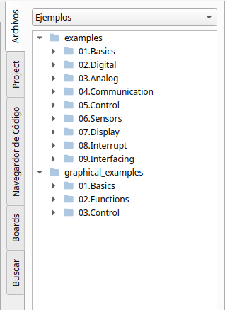

# Pinguino IDE v13

The Pinguino Integrated Development Environment *or Pinguino IDE* main window contains
a text editor for writing code, a Python shell console, a log console, a stdout windows,
a toolbar with buttons for common functions, a sidebar, a status bar and a series of menus.
It connects to the Pinguino board to upload programs and communicate with them.

## Menu

Additional commands are found within the eight menus: File, Edit, Project, Settings, Source,
Debug, Tools, Help.

## Toolbar

The toolbar buttons allow you to create new files, create new block file, open files,
save the current file, undo the last action, redo, cut the selected code, copy, paste, search,
select the right Pinguino board, compile and upload your code to the board, and save the compiled
image; in that order.

## Text editor

The programs are writen in the text editor area and are saved with the `*.pde` extension.
The editor has the following features:

* Cutting/copy/pasting text.
* Searching/replacing text.
* Undo/redo actions.
* Comment/uncomment regions.
* Indent/Outdent.
* Manage one or more files simultaneously through tabs.

The text editor also have autocomplete capabilities, syntax highlighting and program line numbers.

## Log console

The message log area gives feedback while compile and upload code to the board,
and alsodisplays errors.

## Side bar

Sidebar is divided into five main tabs: Files, Project, Code browser, Boards, and Search.

## Status bar

The status bar provides information about the board type, programming mode and compiler
currently selected in the IDE.

