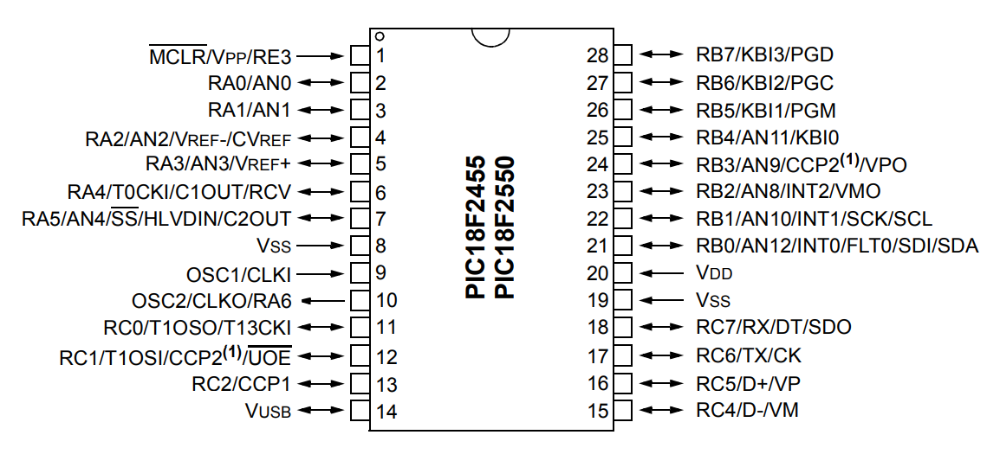
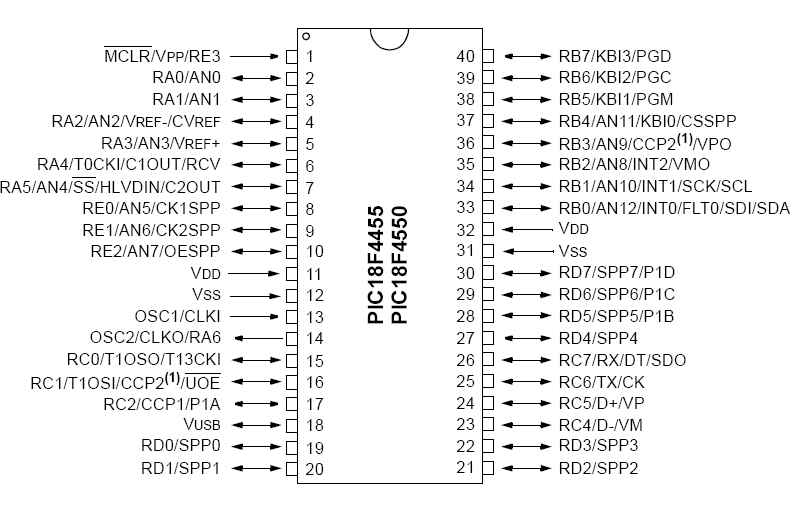

# 8-bit Supported Boards

This is the list of the 8-bit boards that's supported by the current v13 of Pinguino IDE:

| Board name      | Based on chip	| Website	|
|:----------------|:-------------------:|:--------------|
| Pinguino 13K50  | PIC18F13K50		| [www.microchip.com](https://www.microchip.com/wwwproducts/en/PIC18F13K50)|
| Pinguino 14K50  | PIC18F14K50		| [www.microchip.com](https://www.microchip.com/wwwproducts/en/PIC18F14K50)|
| Pinguino 25K50  | PIC18F25K50		| [www.microchip.com](https://www.microchip.com/wwwproducts/en/PIC18F25K50)|
| Pinguino 26J50  | PIC18F26J50		| [www.microchip.com](https://www.microchip.com/wwwproducts/en/PIC18F26J50)|
| Pinguino 27J53  | PIC18F27J53		| [www.microchip.com](https://www.microchip.com/wwwproducts/en/PIC18F27J53)|
| Pinguino 45K50  | PIC18F45K50		| [www.microchip.com](https://www.microchip.com/wwwproducts/en/PIC18F45K50)|
| Pinguino 46J50  | PIC18F46J50		| [www.microchip.com](https://www.microchip.com/wwwproducts/en/PIC18F46J50)|
| Pinguino 47J53A | PIC18F47J53-A	| [www.microchip.com](https://www.microchip.com/wwwproducts/en/PIC18F47J53)|
| Pinguino 1459   | PIC16F1459		| [www.microchip.com](https://www.microchip.com/wwwproducts/en/PIC16F1459)|
| Pinguino 2455   | PIC18F2455		| [www.microchip.com](https://www.microchip.com/wwwproducts/en/PIC18F2455)|
| Pinguino 2550   | PIC18F2550		| [www.microchip.com](https://www.microchip.com/wwwproducts/en/PIC18F2550)|
| Pinguino 4455   | PIC18F4455		| [www.microchip.com](https://www.microchip.com/wwwproducts/en/PIC18F4455)|
| Pinguino 4550   | PIC18F4550		| [www.microchip.com](https://www.microchip.com/wwwproducts/en/PIC18F4550)|
| Pinguino Torda  | PIC18F47J53-B	| [www.microchip.com](https://www.microchip.com/wwwproducts/en/PIC18F47J53)|
| CHRP3.0         | PIC16F886 PIC18F25K50	| [www.siriusmicro.com](https://www.siriusmicro.com/chrp3.html)|
| Curiosity 1708  | PIC16F1708		| [www.microchip.com](https://www.microchip.com/promo/curiosity-development-boards)|
| Amicus 18       | PIC18F25K20		| [www.myamicus.co.uk](http://www.myamicus.co.uk/)|
| FreeJALduino    | PIC18F2550 PIC18F4550	| [freejalduino.wordpress.com](https://freejalduino.wordpress.com/)|
| PIC Uno Equo    | -                   | -             |

## PIC18F2550

Ideal for low power (nanoWatt) and connectivity applications that benefit from the availability
of three serial ports: FS-USB (12 Mbit/s), I²C™ and SPI™ (up to 10Mbit/s) and an asynchronous
(LIN capable) serial port (EUSART).

Large amounts of RAM memory for buffering and Enhanced FLASH
program memory make it ideal for embedded control and monitoring applications that require periodic
connection with a (legacy free) Personal Computer via USB for data upload/download and/or
firmware updates.

| Parameter name		| Param Vvalue	|
|:------------------------------|:--------------|
| CPU Speed (MIPS)		| 12		|
| Program Memory Size		| 32768 Bytes	|
| Data Memory Size		| 2048 Bytes	|
| Data EEPROM/HEF		| 256 bytes	|
| Interrupt Sources		| 19		|
| Digital Comm			| 1-UART, 1-SPI, 1-I2C, 1-MSSP(SPI/I2C) |
| Capture / Compare / PWM	| 2 Input Capture, 2 CCP	|
| Timers			| 1 x 8-bits, 3 x 16-bits	|
| ADC Input			| 10 ch, 10-bit	|
| Number of Comparators		| 2		|
| Number of USB modules		| 1, FS Device	|
| Temperature Range		| -40 to 85 ºC	|
| Operating Voltage Range	| 2 to 5.5 V	|
| Pin Count			| 28		|

### Pinout

### Basic Diagram

## PIC18F4550

Ideal for low power (nanoWatt) and connectivity applications that benefit from the availability
of three serial ports: FS-USB(12Mbit/s), I²C™ and SPI™ (up to 10 Mbit/s) and an asynchronous
(LIN capable) serial port (EUSART).

Large amounts of RAM memory for buffering and Enhanced Flash
program memory make it ideal for embedded control and monitoring applications that require periodic
connection with a (legacy free) personal computer via USB for data upload/download and/or
firmware updates.

| Parameter name		| Param Vvalue	|
|:------------------------------|:--------------|
| CPU Speed (MIPS)		| 12		|
| Program Memory Size		| 32768 Bytes	|
| Data Memory Size		| 2048 Bytes	|
| Data EEPROM/HEF		| 256 bytes	|
| Interrupt Sources		| 20		|
| Digital Comm			| 1-UART, 1-SPI, 1-I2C, 1-MSSP(SPI/I2C) |
| Capture / Compare / PWM	| 1 CCP, 1 ECCP	|
| Timers			| 1 x 8-bits, 3 x 16-bits	|
| ADC Input			| 13 ch, 10-bit	|
| Number of Comparators		| 2		|
| Number of USB modules		| 1, FS Device	|
| Temperature Range		| -40 to 85 ºC	|
| Operating Voltage Range	| 2 to 5.5 V	|
| Pin Count			| 40		|

### Pinout

### Basic Diagram

